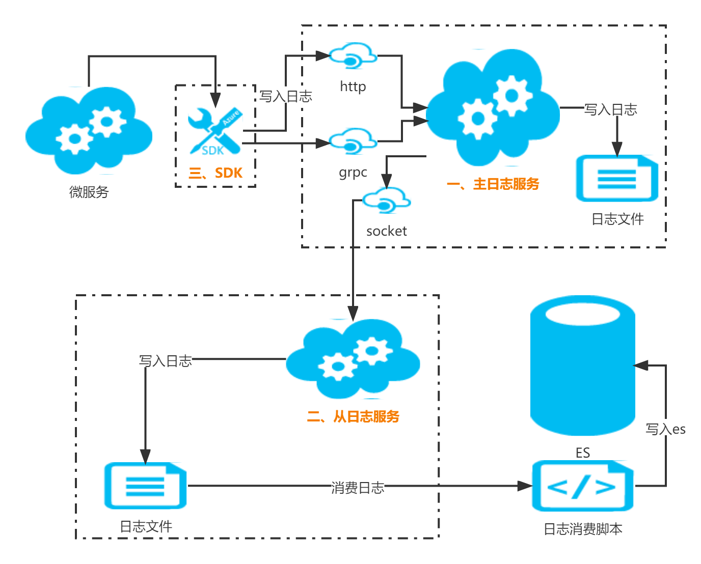

# go-remote-log

- [简介](#简介)
- [特点](#特点)
- [基本结构](#基本结构)
  - [主服务](#主服务)
  - [从服务](#从服务)
  - [日志sdk](#日志sdk)
- [使用方法](#使用方法)  
  - [安装](#安装)
  - [引入](#引入)
  - [使用案例](#使用案例)
  - [其他](#其他)
  - [使用示例](#使用示例)
- [变更历史](#变更历史)

## 简介
- 本日志系统由服务端和客户端组成，服务端相当于主日志，客户端相当于从日志
- 相关技术: golang; grpc; github.com/loudbund/go-filelog/filelog_v1; github.com/loudbund/go-socket2/socket2

## 特点
- 服务端接收日志数据，并将日志数据记录到文件系统，
  - 服务端提供sdk，供业务将写日志时调用
  - 服务端提供socket接口，供客户端端同步日志数据
- 客户端通过socket连接服务端，并将日志同步写入到客户端文件系统


## 基本结构
日志汇总同步系统，共分为3部分

### 一. 主服务 
（部署外网）

|序|名称|函数|
|:---:|---|---|
|1|实例化服务|remote_log.NewServer(Ip string, PortSocket, PortGRpc int, logFolder string) *Server|
|2|直接写入日志数据|server.CommitData(DataType int16, Data []byte) |

>用途
1. 接收日志数据
2. 存储日志数据
3. 为内网终端同步日志提供服务
>配置端口
1. grpc端口(内部用)：grpc方式接收日志
2. tcp端口(外部用)：内网通过这个端口同步日志到内网
>配置磁盘目录
1. 设置一个磁盘目录存储日志
2. (存储参见 github.com/loudbund/go-filelog/filelog_v1 )
3. 外网也可以直接解析这个日志数据加工处理

|序|文件|说明|
|:---:|---|---|
|1|${date}/index|索引|
|2|${date}/data000000|数据文件1|
|3|${date}/data000001|更多数据文件|

### 二. 从服务
（部署内网）

|序|名称|函数|
|:---:|---|---|
|1|实例化服务|remote_log.NewClient(serverIp string, serverPort int, logFolder string, opt ...ClientOptions) *Client|
|2|直接写入日志数据|server.CommitData(DataType int16, Data []byte) |

>用途
1. 作为服务端日志的从服务，
2. 日志数据和主服务数据完全一致，可能有很短延时
3. 终端脚本可以直接解析日志数据加工处理
>配置端口
1. 主服务提供的socket端口
>配置磁盘目录
1. 日志存储的目录
2. (存储参见 github.com/loudbund/go-filelog/filelog_v1 )

|序|文件|说明|
|:---:|---|---|
|1|${date}/index|索引|
|2|${date}/data000000|数据文件1|
|3|${date}/data000001|更多数据文件|
|4|${date}/finish|日期日志结束符，无内容|

### 三. 日志sdk（外网app使用）
> app引入包，初始化日志服务地址后，直接调用包函数提交日志

## 使用方法
### 安装
go get github.com/loudbund/go-remote-log

### 引入
```golang
import "github.com/loudbund/go-remote-log/remote_log"
```

### 使用案例
>程序流程日志和错误日志系统


1. 部署服务端接收日志(参见example)
2. 微服务引入包，调用sdk函数写入日志到服务(参见example)
3. 内网部署客户端从服务同步日志(参见example)
4. 内网编写消费日志并写入es脚本（消费日志数据参见github.com/loudbund/go-filelog的example)
5. 在es里检索日志数据

### 其他
socket消息类型列表

|序|CType|类型|方向|说明|
|:---:|:---:|:---:|---|---|
|1|7|socket2|client->server|客户端连接发送测试消息|
|2|8|socket2|server->client|服务端回复测试消息|
|3|301|remote_log|client->server|通知接收日期变更|
|4|302|remote_log|server->client|日志内容消息|
|5|303|remote_log|server->client|服务器通知客户端日期内消息发送完成|

### 使用示例
详见example-server/,example-client/

|序|example|说明|
|:---:|:---|:---|
|1|example-server/example_server.go|服务端示例|
|2|example-server/logsend.go|发grpc消息给服务端示例|
|3|example-client/example_client.go|从服务端示例|
|4|example-client/scan|从服务端消费日志示例|

## 代码维护说明
- go-remote-log/remote_log/server.go …… 服务端主程序
- go-remote-log/remote_log/client.go …… 客户端主程序
- go-remote-log/remote_log/sdk.go …… 日志写入sdk
- go-remote-log/modsysclog_read_logs/read_logs.go …… 读取工具
- go-remote-log/example-server/ …… 服务端示例
- go-remote-log/example-client/ …… 客户端示例

## 变更历史
- 2022-10-08 …… 客户端增加日志清理功能
